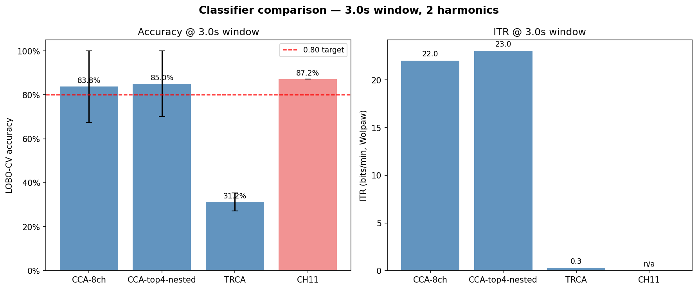

# BR41N.IO 2026 SSVEP — 1st Place, BCI Data Analysis Projects

A 33-hour hackathon submission that placed **1st in the BCI Data Analysis
Projects track** at BR41N.IO 2026 Spring School. Goal: decode steady-state
visual evoked potentials (SSVEP) from 8 occipital EEG channels recorded
on a g.tec g.USBamp, then beat the live g.tec LDA reference (CH11 in the
recording) on accuracy + ITR + trial coverage.

We built a clean ablation across three classifier families — CCA (Lin
2007), filter-bank CCA (Chen 2015), ensemble TRCA (Nakanishi 2018) —
plus per-subject SNR-ranked channel selection with leakage-free nested
cross-validation. **Filter-bank CCA wins decisively** at 95.0% accuracy
on 100% trial coverage versus the live LDA's 87.2% on only 49%
coverage. TRCA underperforms by 30–40 pp at every fold; the negative
result is documented as a property of the data regime (5 trials/class
sits below Nakanishi's 11-trial saturation threshold).

Every load-bearing number in this README has been independently
re-derived from the raw `.mat` files and matches the published CSVs to
≤ 0.001 — see [results/audit_report.md](results/audit_report.md) for
the full provenance trace.

## Headline result



**Cross-subject 4-block leave-one-block-out CV, 3 s analysis window, 2 harmonics:**

| Classifier | Accuracy | Std | ITR (bpm) | Coverage | Notes |
|---|---|---|---|---|---|
| CCA-8ch | 0.838 | 0.163 | 22.0 | 100% | Lin 2007, all 8 occipital channels |
| CCA-top4-nested | 0.850 | 0.150 | 23.0 | 100% | Per-fold SNR-ranked top 4, leakage-free |
| **FBCCA** | **0.950** | **0.061** | **32.7** | **100%** | Chen 2015, 5 sub-bands, n⁻¹·²⁵+0.25 weights |
| TRCA | 0.312 | 0.041 | 0.3 | 100% | Nakanishi 2018; documented negative result (see methodology note) |
| CH11 (g.tec live LDA) | 0.872 | n/a | n/a | **49%** | SOTA reference; no decision on 51% of trials |

FBCCA's within-subject TRCA companion number (under the Nakanishi
2018 protocol) is 0.475 with subject 1 = 0.675 / subject 2 = 0.275 —
the within-subject framing recovers 16 pp for TRCA without changing
the FBCCA-vs-CCA ranking. Full per-subject decomposition lives in
[results/within_subject_evaluation.md](results/within_subject_evaluation.md).

## The universality framing

The dataset has 2 subjects × 2 sessions. Subject 1 produces a textbook
SSVEP response — every reasonable classifier hits 100%. Subject 2's
response is noisier and less stimulus-locked: standard CCA tops out at
67.5%. This is the universality problem documented in
[Guger et al. 2012](data/raw/How_many_people_could_use_an_SSVEP_BCI.pdf):
the fraction of the population for whom SSVEP BCIs work cleanly is not
100%.

The classifier comparison is fundamentally the question of how much
each method recovers on subject 2 without losing subject 1:

| Classifier | Subject 1 | Subject 2 | Cost on S1 | Lift on S2 |
|---|---|---|---|---|
| CCA (H=2) | 1.000 | 0.675 | — | — |
| **FBCCA (H=2)** | **1.000** | **0.900** | 0.000 | **+0.225** |
| FBCCA (H=5, methodology note default) | 0.975 | 0.775 | 0.025 | +0.100 |
| TRCA | 0.675 | 0.275 | −0.325 | −0.400 |
| CH11 (on fired) | 1.000 (10/40 fired) | 0.828 (29/40 fired) | — | — |

(Within-subject 4-fold LOBO at 3 s — Nakanishi 2018 protocol.)

**FBCCA wins because of harmonic recovery.** Subject 2's fundamental-
frequency SNR is weak, but the harmonic content is intact; FBCCA's
sub-band weighting captures it. CCA and TRCA can't. This is the
quantitative answer to the universality problem on this dataset.

## Repository structure

```
br4in_ssvep/
├── README.md                       # this file
├── LICENSE                         # MIT, 2026 Ishanvir Choongh
├── pyproject.toml                  # setuptools config; package = src/ssvep, requires-python >=3.11
├── environment.yml                 # conda env "br41n-ssvep" (Python 3.11 + numpy/scipy/mne/sklearn/...)
├── requirements.txt                # pip equivalent
├── .gitignore
│
├── src/ssvep/                      # canonical pipeline package
│   ├── __init__.py                 # re-exports + RANDOM_SEED = 42
│   ├── io.py                       # load_continuous / load_mat / load_all (continuous schema, trigger-driven epoching)
│   ├── preprocessing.py            # filter_continuous + PREPROCESSING_PRESETS (notch + bandpass before epoching, MNE-backed)
│   ├── features.py                 # cca_reference_signals, psd (Welch), snr_at_freq
│   ├── channel_selection.py        # rank_channels_by_snr, channel_snr_matrix, sweep_channel_subsets
│   ├── evaluation.py               # accuracy, confusion_matrix, itr (Wolpaw 1998), leave_one_block_out_cv
│   ├── synthetic.py                # make_synthetic_dataset (matches load_mat schema)
│   ├── viz.py                      # plot_psd, plot_topomap_at_freq, plot_spectrogram, plot_confusion
│   └── classifiers/
│       ├── __init__.py             # re-exports CCA / FBCCA / TRCA classes
│       ├── cca.py                  # Lin 2007 — CCA against canonical sin/cos refs
│       ├── fbcca.py                # Chen 2015 — 5 Cheb I sub-bands, weighted squared-ρ aggregation
│       └── trca.py                 # Nakanishi 2018 — ensemble TRCA, port of meegkit (BSD-3)
│
├── notebooks/                      # 01..09; see notebooks/README.md
│   ├── 01_data_exploration.ipynb       # full dataset characterization, CH11 mapping recovery
│   ├── 02_preprocessing.ipynb          # VT — bandpass/notch/window scan; chosen defaults
│   ├── 03_cca_baseline.ipynb           # CCA pedagogical wrapper; LOBO 0.838
│   ├── 04_fbcca.ipynb                  # filter-bank CCA pedagogical wrapper; LOBO 0.950
│   ├── 05_trca.ipynb                   # TRCA + documented negative-result analysis
│   ├── 06_comparison_and_itr.ipynb     # full ablation + Wolpaw ITR sweep
│   ├── 07_demo.ipynb                   # presentation demo
│   ├── 08_channel_selection.ipynb      # Yuki — per-subject SNR-ranked channels
│   ├── 09_topomap_vt.ipynb             # VT — topomap + channel-stability viz
│   ├── README.md                       # notebook index + reading order
│   └── preprocessing_parameter_testing_results/   # CSV outputs from notebook 02
│
├── scripts/
│   ├── setup.ps1                       # one-command Windows env setup
│   ├── run_baseline.py                 # single-file CCA runner (--mat | --synthetic, ±filter flags)
│   ├── verify_ch11.py                  # 24-permutation CH11 mapping sweep
│   ├── sweep_cca_windows.py            # 10-window × 3-config CCA sweep → CSV + slide-ready PNG
│   └── compare_classifiers.py          # headline harness (--protocol, --window, --harmonics, --data-dir)
│
├── tests/
│   ├── __init__.py
│   └── test_smoke.py                   # 16 tests: imports, refs, ITR, CCA, LOBO, real data, continuous-first, FBCCA, TRCA
│
├── data/
│   ├── README.md                       # provenance, channel layout, recording params, CH11 mapping derivation
│   ├── raw/                            # gitignored — .mat files + Guger 2012 PDF + montage.png
│   └── processed/                      # gitignored — caches, intermediate arrays
│
├── results/
│   ├── README.md                       # results index
│   ├── audit_report.md                 # end-to-end provenance audit (verification source of truth)
│   ├── within_subject_evaluation.md    # protocol justification + within-subject headline numbers
│   ├── trca_methodology_note.md        # TRCA negative-result analysis
│   ├── channel_selection.md            # Yuki's writeup
│   ├── tables/                         # comparison_*.csv, cca_window_sweep*.csv (12 files)
│   └── figures/                        # 19 PNGs: comparison bars, sweep curves, topomaps, channel rankings
│
├── LICENSES/
│   └── meegkit-BSD-3.txt               # BSD-3 attribution for the TRCA port
│
└── presentation/                       # slide assets (gitkept)
```

## Quickstart

```bash
git clone https://github.com/ishanvirc/BR4IN_SSVEP.git
cd BR4IN_SSVEP

# Conda (recommended)
conda env create -f environment.yml && conda activate br41n-ssvep && pip install -e .
# OR pure pip
python -m venv .venv && source .venv/bin/activate && pip install -r requirements.txt && pip install -e .

# Smoke check (works without data/raw/)
python scripts/run_baseline.py --synthetic
pytest tests/ -q                                 # 16 passed

# Headline classifier comparison (requires data/raw/*.mat)
python scripts/compare_classifiers.py --window 3.0 --harmonics 2
# Within-subject protocol (Nakanishi 2018):
python scripts/compare_classifiers.py --protocol within_subject --window 3.0 --harmonics 2

# CCA window-length sweep
python scripts/sweep_cca_windows.py

# CH11 sanity
python scripts/verify_ch11.py
```

`pip install -e .` is what makes `from ssvep import ...` work
everywhere (notebooks, scripts, tests). Python 3.11+ required per
[pyproject.toml](pyproject.toml).

The raw `.mat` files (`subject_{1,2}_fvep_led_training_{1,2}.mat`) are
distributed by g.tec at the hackathon kickoff and not included in
this repo. See [data/README.md](data/README.md) for the schema.

## Notebooks

Read in order. Each notebook is a thin pedagogical wrapper around the
`src/ssvep/` and `scripts/` APIs — none of them reimplement the
algorithms. Full index in [notebooks/README.md](notebooks/README.md).

| # | Notebook | What it shows |
|---|---|---|
| 01 | data_exploration | Raw `.mat` schema, trial structure, CH11 → stim-freq mapping recovery |
| 02 | preprocessing (VT) | Bandpass / notch / window parameter scan; chosen defaults |
| 03 | cca_baseline | CCA against canonical sin/cos refs; cross-subject LOBO = 0.838 |
| 04 | fbcca | 5-sub-band Chebyshev-I filter bank, squared-ρ aggregation; LOBO = 0.950 |
| 05 | trca | Eigenvalue solve, ensemble filters; documented negative result |
| 06 | comparison_and_itr | Full ablation + Wolpaw ITR sweep across windows |
| 07 | demo | Clean demo for presentation |
| 08 | channel_selection (Yuki) | Per-subject SNR-ranked top-4; cross-subject channel transfer test |
| 09 | topomap_vt (VT) | Topomap visualizations; channel-stability heatmaps |

All notebooks are committed with executed outputs — read them on
GitHub without running locally.

## Results artifacts

Key files in [results/](results/) (full index in
[results/README.md](results/README.md)):

| File | Contains |
|---|---|
| [audit_report.md](results/audit_report.md) | Verification source of truth — every load-bearing number traced back to raw `.mat` |
| [within_subject_evaluation.md](results/within_subject_evaluation.md) | Why within-subject LOBO is the protocol the literature uses; per-subject means |
| [trca_methodology_note.md](results/trca_methodology_note.md) | TRCA negative-result mechanism analysis (3 converging causes) |
| [channel_selection.md](results/channel_selection.md) | Yuki's per-subject SNR analysis |
| [tables/comparison_3s.csv](results/tables/comparison_3s.csv) | Headline cross-subject 3 s comparison row-by-row |
| [tables/comparison_within_subject_3s.csv](results/tables/comparison_within_subject_3s.csv) | Same under within-subject LOBO |
| [tables/cca_window_sweep_nested.csv](results/tables/cca_window_sweep_nested.csv) | CCA at 10 window lengths, with per-fold nested channel selection |
| [figures/comparison.png](results/figures/comparison.png) | Headline bar chart (embedded above) |
| [figures/cca_window_sweep_with_nested.png](results/figures/cca_window_sweep_with_nested.png) | 3-line CCA window sweep (slide-ready) |
| [figures/channel_stability_topomap_*.png](results/figures/) | VT's channel-stability topomaps |

## Methodology notes

If you only read three things in this repo, read these:

1. [results/audit_report.md](results/audit_report.md) — verifies every published number end-to-end. Independent re-derivation matches CSV to ≤ 0.001 across all 80 trials, both protocols, all 4 windows, both harmonic counts.
2. [results/within_subject_evaluation.md](results/within_subject_evaluation.md) — explains why within-subject LOBO is the methodologically correct protocol, and why FBCCA wins under both protocols.
3. [results/trca_methodology_note.md](results/trca_methodology_note.md) — the TRCA negative result is not a bug; it's a documented property of the data regime relative to Nakanishi 2018's published thresholds.

## Citations

- **Lin, Z., Zhang, C., Wu, W., & Gao, X. (2007).** *Frequency Recognition Based on Canonical Correlation Analysis for SSVEP-Based BCIs.* IEEE Trans. Biomed. Eng. 54(6):1172–1176.
- **Chen, X., Wang, Y., Gao, S., Jung, T.-P., & Gao, X. (2015).** *Filter bank canonical correlation analysis for implementing a high-speed SSVEP-based brain-computer interface.* J. Neural Eng. 12:046008.
- **Nakanishi, M., Wang, Y., Chen, X., Wang, Y.-T., Gao, X., & Jung, T.-P. (2018).** *Enhancing Detection of SSVEPs for a High-Speed Brain Speller Using Task-Related Component Analysis.* IEEE Trans. Biomed. Eng. 65(1):104–112.
- **Guger, C., Allison, B. Z., Großwindhager, B., Prückl, R., Hintermüller, C., Kapeller, C., Bruckner, M., Krausz, G., & Edlinger, G. (2012).** *How Many People Could Use an SSVEP BCI?* Front. Neurosci. 6:169.
- **Wolpaw, J. R., et al. (1998).** *EEG-based communication: improved accuracy by response verification.* IEEE Trans. Rehabil. Eng. 6(3):326–333. (ITR formula.)

## License and acknowledgments

This repository's original code is released under the **MIT License** —
see [LICENSE](LICENSE).

The TRCA implementation in [src/ssvep/classifiers/trca.py](src/ssvep/classifiers/trca.py)
is a port of [meegkit](https://github.com/nbara/python-meegkit)'s
standalone `_trca` function and remains under its original BSD 3-Clause
license — full attribution in [LICENSES/meegkit-BSD-3.txt](LICENSES/meegkit-BSD-3.txt).

The hackathon dataset was distributed by **g.tec medical engineering
GmbH** at the BR41N.IO 2026 Spring School Hackathon. The Guger et al.
2012 paper bundled in [data/raw/](data/raw/) describes the g.USBamp
hardware and live LDA pipeline that produced the CH11 reference signal
used as the SOTA benchmark in this work.

Team: Ishanvir Choongh, Yuki, VT.
